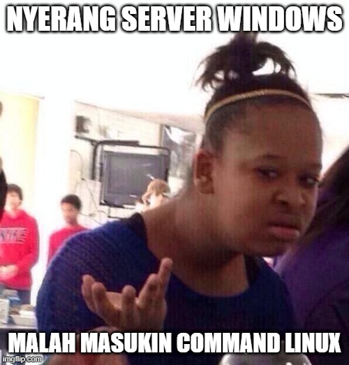
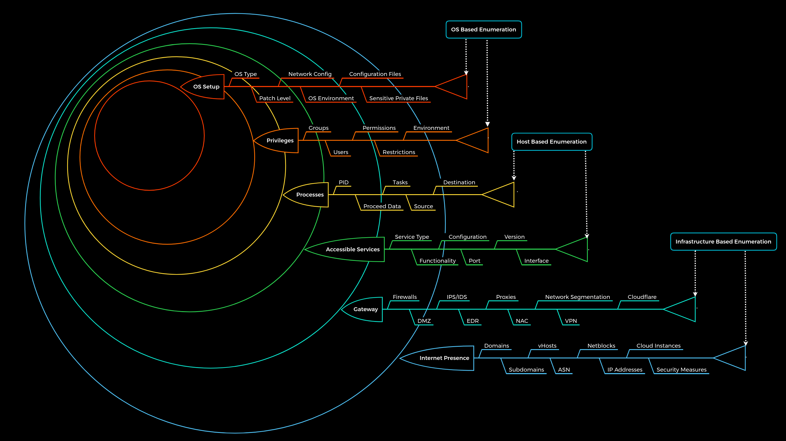
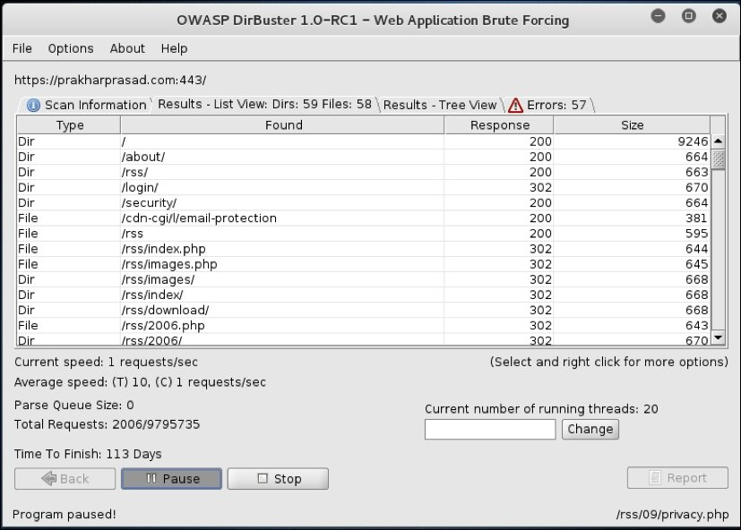

# Keamanan Web dan Aplikasi

---

## Reconnaissance

_Recon bukan cuma ngejalanin tools dalam command line. Recon adalah seni menemukan langkah langkah kecil menuju kemenangan._

<p align="center"></p>

Proses pencarian celah keamanan dalam website tidak memakan waktu satu atau dua jam saja, bisa saja dalam hitungan hari, minggu, ataupun bulan. Proses penetration testing sudah dijelaskan pada modul sebelumnya,  dan langkah pertamanya adalah Reconnaissance. **Reconnaissance** adalah aktivitas untuk mengumpulkan informasi mengenai target yang dapat menjadi pintu pertama dalam mengeksploitasi.

## Kenapa recon penting?

Kenapa kita harus melakukan recon? tahapan ini sangat membosankan, bisakah kita langsung lakukan serangan saja misalnya sql injection, xss injection? Yap, pertanyaan yang tidak salah dalam permulaan memelajari penetration testing, recon memang tahapan yang bisa dibilang _**membosankan**_, banyaknya tools, lamanya waktu dalam scanning, keinginan untuk langsung mengeksplorasi target, adalah banyak dari sekian hal yang membuat tahapan recon menjadi hal yang membosankan. Tapi sebagai penetration tester kita akan lebih sering menemunkan kebuntuan/kesalahan jika menjalankan tahapan recon dengan tidak mendetail.  Misalnya ketika kita melakukan pentest (penetration testing) pada website dengan backend node js tetapi karena kita tidak detail dalam tahapan recon kita malah melakukan serangan code injection dengan bahasa php. Semakin lengkap informasi yang didapatkan dari target semakin besar presentase keberhasilan pada fase selanjutnya.

<p align="center"></p>

## Recon objective

Apa aja sih yang seharusnya didapatin dari fase recon?

- **Network**
  - DNS
  - IP networks
  - Open Ports
  - Websites
  - Access Control
  - VPN Endpoints
  - Firewall vendors
  - IDS Systems
  - Routing/Routed Protocols

- **Organization**
  - Org Structure
  - Websites
  - Phone Numbers
  - Directory Information
  - Office Locations
  - Company History
  - Business Associations

- **Hosts**
  - Listening Services
  - Operating System Versions
  - Internet Reachability
  - Enumerated Information
  - SNMP Info
  - Users/Groups
  - Subdomain

<p align="center"></p>

## How to perform recon?

- **[Nmap](https://nmap.org/)** - Finding open ports
  

Kenapa kita perlu mengetahui apa saja port yang terbuka? serangan atau celah keamanan bisa muncul dari mana saja, tidak semua data breach berasal dari website, bisa saja berasal dari kesalahan konfigurasi pada FTP service, SSH service ataupun lain sebagainya, bisa saja terdapat website tersembunyi yang diletakan pada port yang tidak sewajarnya misalnya pada port 5000. Nmap merupakan tools untuk melakukan enumerasi utamanya untuk menemukan port apa saja yang terbuka. Tidak hanya itu nmap juga bisa melakukan banner grabbing untuk menemukan versi dari service yang dijalankan. Nmap merupakaan tools yang sangat powerfull dikarenakan banyaknya opsi dan fitur yang diberikan, salah satunya adalah menemukan celah keamanan dari suatu servis berdasarkan versinya atau commmon misconfiguration.
  <br>

- **nmap -sC (default script)**
  <br>

  ```
  nmap -sC 192.168.56.102 -p 21
  ```

  
  Dengan menggunakan tag -sC nmap akan menjaalankan script default (script yang melakukan testing terhadap common misconfiguration). Disini contohnya jika target mengekspos port 21 (port untuk service FTP) dan ternyata terdapat misconfiguration dimana attacker dapat login menggunakan user _anonymous_ atau unauthorized user, nmap dapat menemukan celah keamanan ini dan memberikan informasi kepada attacker.
  <br>&nbsp;</br>

- **nmap fast scan**

  ```
  nmap -F 192.168.56.102 
  ```

  <br>&nbsp;</br>

- **nmap scan all ports**
  <br>

  ```
  nmap -p- 192.168.56.102
  ```

  <br>&nbsp;</br>

- **nmap fast scan**
  <br>

  ```
  nmap -F 192.168.56.102
  ```

  <br>&nbsp;</br>

- **nmap aggresive scan**
  <br>

  ```
  nmap -A 192.168.56.102
  ```

  <br>&nbsp;</br>

- **nmap most common used tag**
  <br>

  ```
  nmap -A -T4 -v -p- 192.168.56.102 -oN nmap_result
  ```

  ```
  -T4 untuk menentukan lamanya scanning
  -v untuk menambahkan lebih banyak ketarangan pada scanning
  -oN untuk membuat file nmap_result yang berisi hasil dari scanning nmap (sangat berfungsi untuk menyimpan hasil recon)
  ```

**_notes : [link](https://github.com/jasonniebauer/Nmap-Cheatsheet) cheatsheet nmap_**

- **Domain Name System**
  Domain name system merupakan buku telepon pada internet. Sebagai manusia kita biasanya mengakses suatu website menggunakan nama domain misalnya google.com, github.com, sedangkan web browser berkomunikasi dengan website menggunakan IP address. DNS adalah teknologi yang menerjemahkan IP address menjadi sebuah nama domain.
    <br>
  - **/etc/hosts**
    Dalam sebuah komputer terdapat file hosts, pada linux ini berada pada /etc/hosts dan pada windows ini berada pada C:\Windows\System32\drivers\etc\hosts. File inilah yang menerjemahkan ip address menjadi host name. Terkadang jika kita melakukan penetration testing pada internal network suatu perusahaan mereka menggunakan IP internal seperti 10.x.x.x , umumnya setingan nama domain pada internal network perlu ditambahkan secara manual. Misalnya ip 10.17.100.13 seharusnya nama domain nya adalah archive.htb namun ketika kita mencoba mengakses archive.htb melalui web browser tidak bisa, maka kita perlu menambahkan ip 10.17.100.13 sebagai archive.htb pada file /etc/hosts kita.

    ```
    127.0.0.1  localhost loopback
    ::1        localhost
    10.17.100.3 archive.htb
    ```

    <br>
  - **bruterforcing subdomain**
    Menemukan subdomain adalah hal kritikal dalam fase recon. Menemukan subdomain berarti memperluas kemungkinan celah keamanan dapat ditemukan. Subdomain dapat ditemukan dari 2 cara, yaitu pasif dan aktif. Pasif artinya kita tidak melakukan interaksi dengan target. Salah satu cara yang digunakan adalah melalu website securitytrails.com. Untuk aktif kita bisa melakukan bruteforcing subdomain dengan menggunakan beberapa tools berikut:

    ```
    gobuster vhost -u https://target.com -t 50 -w subdomains.txt

    wfuzz -c -w /usr/share/wordlists/SecLists/Discovery/DNS/subdomains-top1million-20000.txt --hc 400,404,403 -H "Host: FUZZ.target.com" -u http://target.com -t 100

    #From https://github.com/allyshka/vhostbrute
    vhostbrute.py --url="target.com" --remoteip="10.1.1.15" --base="www.target.com" --vhosts="vhosts_full.list"

    #https://github.com/codingo/VHostScan
    VHostScan -t target.com
    ```

- **Directory Bruteforcing**
  Pada sebuah website pasti terdapat beberapa direktori direktori dengan kegunaanya masing masing. Direktori ataupun file pada website tidak dapat kita temukan secara langsung kecuali jika memang terdapat vulnerability [<u>directory listing</u>](https://portswigger.net/kb/issues/00600100_directory-listing) . Satu - satunya cara yang dapat dilakukan attacker adalah melakukan brute force attack dalam artian attacker mencoba mengakses banyak endpoint berdasarkan wordlist directory yang dia punya.
  <br>&nbsp;
    Tools yang dapat digunakan dalam directory bruteforcing terdapat beberapa misalnya, wfuzz, dirb, dirbuster, gobuster, dan lain lain.
  - **wfuzz**

        ```
        wfuzz -c -z file,/usr/share/wordlists/dirbuster/directory-list-2.3-big.txt --sc 200 http://target.com:8088/FUZZ.php
        ```
  - **gobuster**

        ```
        gobuster -u http://target.com -w /usr/share/seclists/Discovery/Web_Content/common.txt -x php
        ```
  - **dirb**

        ```
        dirb http://target.com
        ```

  - **dirbuster**
        Ada GUI nya tampilanya kurang lebih seperti ini
        
  <br>&nbsp;<br>

  ```
  wordlist directory adalah sekumpulan kata yang umum digunakan sebagai nama direktori atau file
  ```

<br>

- **Positive Testing**
  Positive testing merupakan istilah yang sering digunakan oleh QA engineer ketika melakukan pengujian pada sebuah aplikasi. Positive testing adalah aktivitas melakukan pengujian kegunaan pada sebuah fitur atau fungsi, positive testing ditujukan untuk mengetahui apakah fitur tersebut berfungsi sebgaimana fungsinya atau masih terdapat error. Positive testing dalam proses penetration testing juga dilakukan guna memudahkan attacker untuk memahami fungsi dari sebuah fitur. Pemahaman fitur ataupun logic pada aplikasi vital untuk dimengerti oleh pentester guna mempercepat proses penetration testing.
