# Keamanan Web dan Aplikasi
## Web Proxy

### Introduction
Saat ini, sebagian besar aplikasi web dan mobile bekerja dengan terus menyambung ke server back-end untuk mengirim dan menerima data dan kemudian memproses data ini di perangkat pengguna. Dengan sebagian besar aplikasi sangat bergantung pada server back-end untuk memproses data, pengujian dan pengamanan server back-end menjadi lebih penting.

Untuk menangkap permintaan dan lalu lintas yang lewat antara aplikasi dan server back-end serta memanipulasi permintaan, kita perlu menggunakan *Web Proxy*

### Apa itu Web Proxy
*Web Proxy* adalah tool yang dapat diatur antara browser/mobile dan server back-end untuk menangkap dan melihat semua permintaan web yang dikirim antara keduanya, yang pada dasarnya bertindak sebagai man-in-the-middle (MITM). web proxy bekerja dengan port web biasanya, seperti port 80 (HTTP) dan 443(HTTPS)

### Kegunaan Web Proxy
- Web application vulnerability scanning
- Web fuzzing
- Web crawling
- Web application mapping
- Web request analysis
- Web configuration testing

### Tool yang Biasa Digunakan
Burp Suite
Burp suite terdapat versi community yang gratis untuk digunakan dan ada versi profesional yang berbayar.
Berikut adalah beberapa fitur yang dapat digunakan pada versi yang gratis:
- Repeating requests
- Encoding/Decoding
- Burp Intruder

Pada versi berbayar terdapat fitur tambahan yaitu:
- Web App Scanner
- Fast Burp Intruder

### Download & Install Burp Suite
1. Pertama yang dilakukan adalah mengunduh Burp Suite pada halaman berikut https://portswigger.net/burp/releases sesuaikan dengan OS kalian.
2. Buka Aplikasi Burp suite pilih Temporary Project, klik tombol nmext. Setelah itu pilih Use Burp defaults, klik tombol start Burp

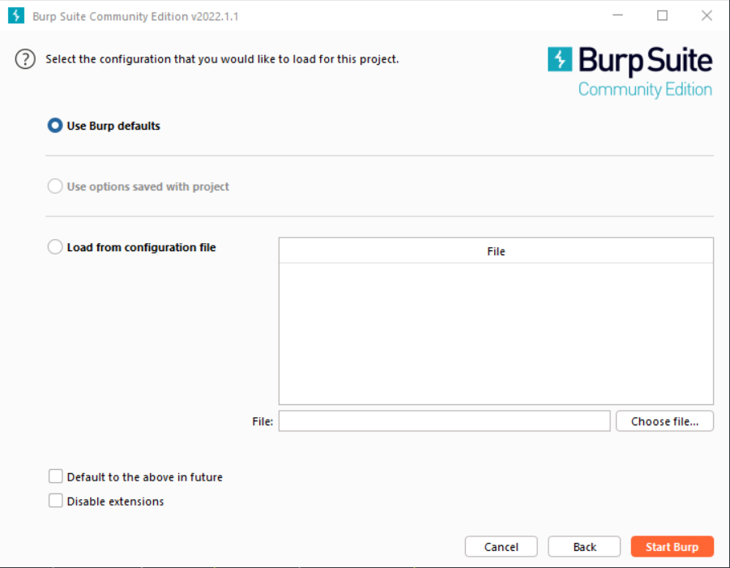

3. Berikut adalah penampilan aplikasinya

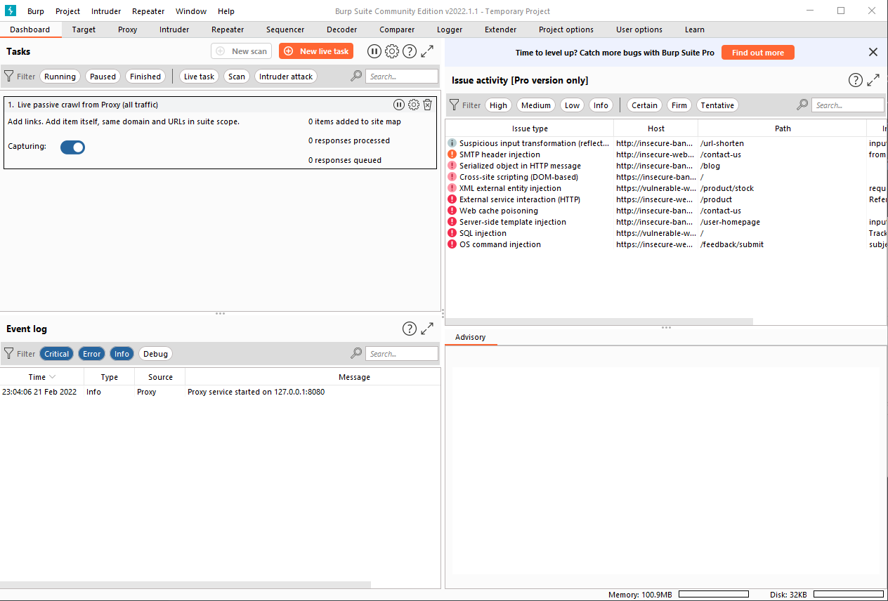

### Proxy Setup
Pertama kita harus melakukan konfigurasi untuk menggunakan proxy pada browser kita. Gunakan ekstensi bernama FoxyProxy Standart

Mau menggunakan firefox ataupun google chrome sama-sama bisa. Setelah terpasang kita bisa konfigurasi proxynya. Tambahkan Proxy dengan IP 127.0.0.1 dengan port 8080. Karena secara default port web proxy dari burp suite adalah 8080
- Tampilan di Firefox
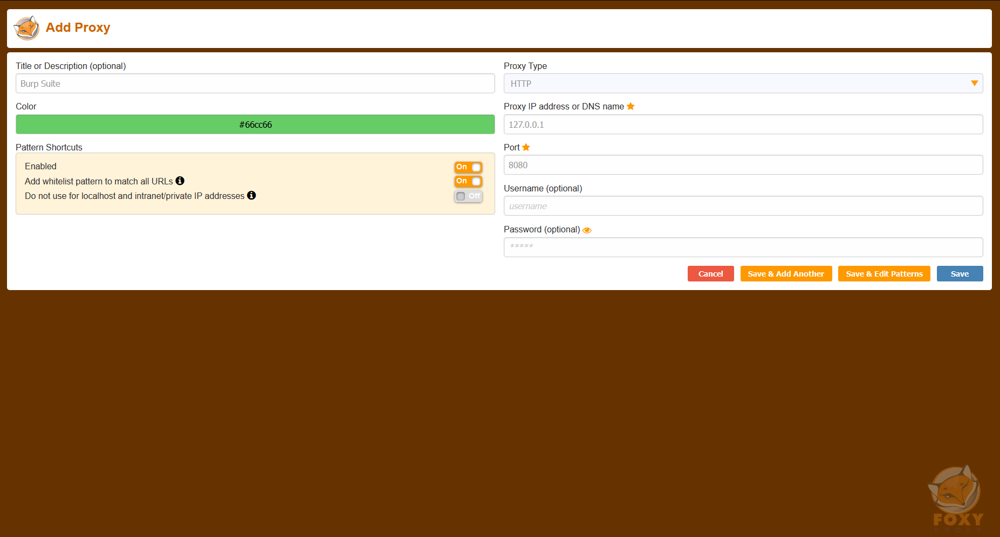
- Tampilan di Google Chrome
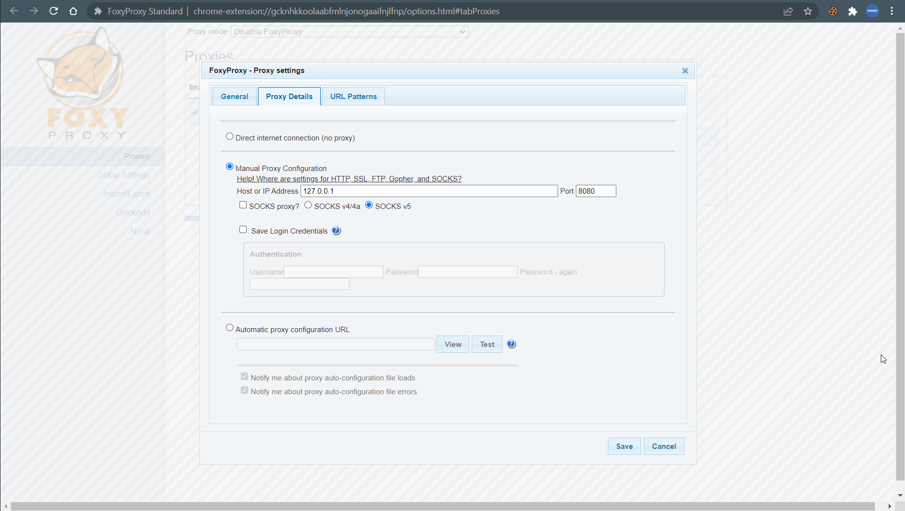

Jangan lupa untuk melakukan turn on pada proxynya.

### Installing CA Certificate
Langkah selanjutnya adalah melakukan install CA Ceritificate dari web proxynya. Akses http://burp pada browser anda. Maka akan terlihat tampilan seperti ini
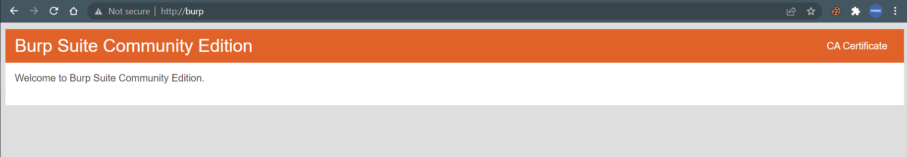

Unduh Certifaicate dengan menekan tombol CA Certificate. Setelah itu tinggal kita pasang CA Certificate pada browser masing masing. Masuk ke bagian setting browser.
- Firefox
Cari Certificates lalu import CA Certificate
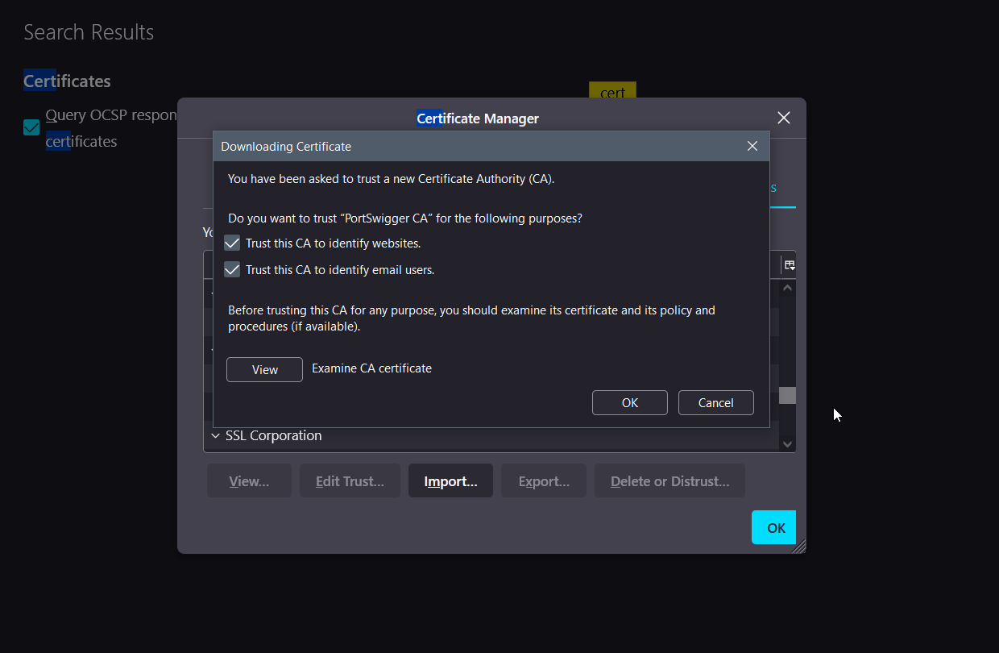
- Google Chrome
Masuk ke Security -> Pilih Manage Certificates. Import CA Certificate yang sudah didownload. Pilih Trusted root Certification Authorities
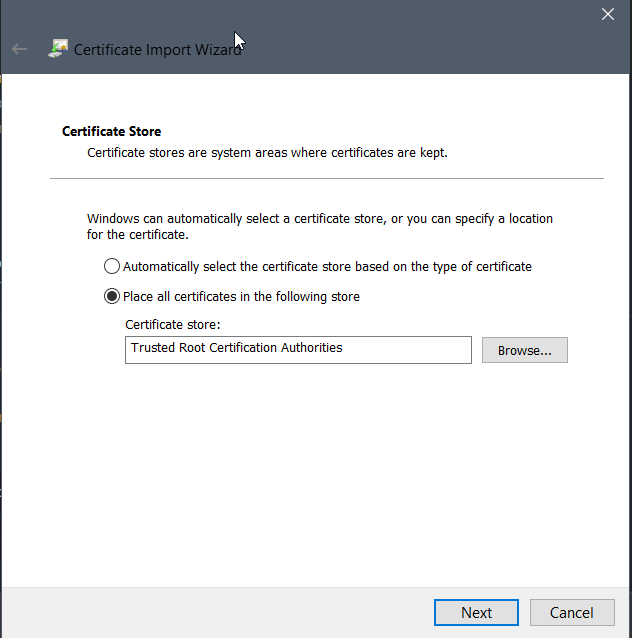
Jika terdapat sebuah pop up klik saja YES.

Setelah seluruh konfigurasi dilakukan maka seluruh lalu lintas akan dirutekan melalui web proxy (Burp Suite)

### Intercepting Web Requests
Setelah melakukan konfigurasi proxy, kita dapat melakukan intercept dan memanipulasi request dari aplikasi web. Pada sesi ini akan mencoba bagaimana cara untuk melakukan intercept request.

Pada Burp suite terdapat tab bernama Proxy. Didalam tab tersebut tedapat fitur Intercept yang dapat digunakan. Untuk mengaktifkan dan menonaktifkan intercept tinggal tekan tombol on atau off. Untuk melanjutkan request ke server aplikasi tinggal tekan tombol forward.

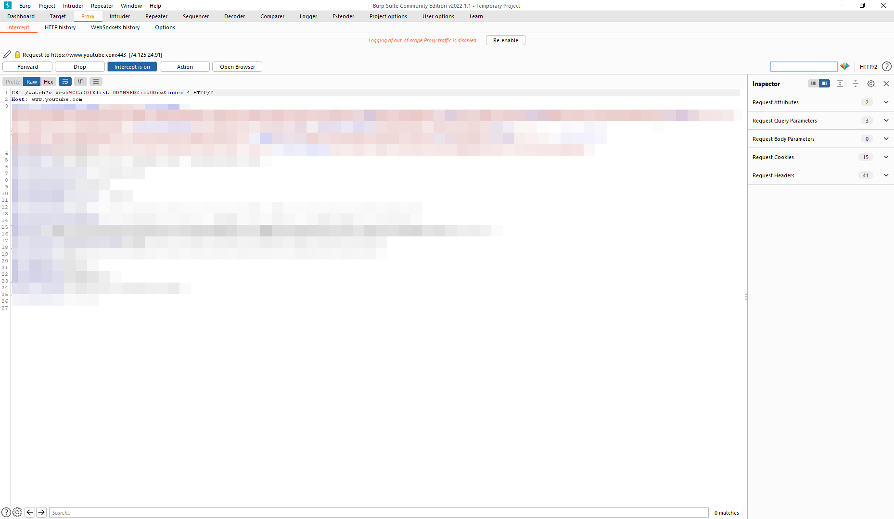

### Repeating Requests
Repeating request memungkinkan kita untuk mengirim ulang permintaan web apapu yang sebelumnya sudah melalui web proxy. Hal ini mempermudah kita untuk memanipulasi pada permintaan tersebut sebelum dikirimkan ke server. Kemudian kita juga bisa melihat response secara langsung.
Cara menggunakannya adalah, di sebelah fitur intercept terdapat tab History. Disana kita bisa lihat history traffict yang melalui proxy listener kita. 

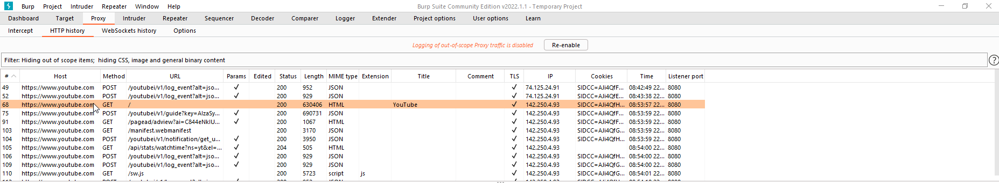

Dari History itu kita dapat pilih salah satu request, klik kana ada pilihan "Send to Repeater". Setelah itu kita dapat berganti ke tab Repeater. Jika ingin mengirim request tinggal klik Button Send

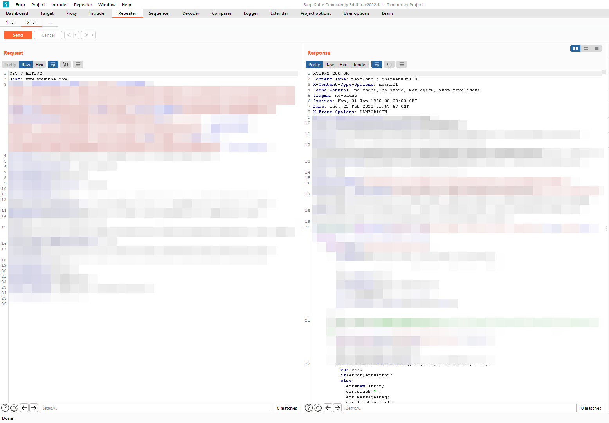

### Encoding/Decoding
Pada Burp Suite terdapat fitur Encoder dan Decoder. Fitur tersebut berada pada tab Decoder.
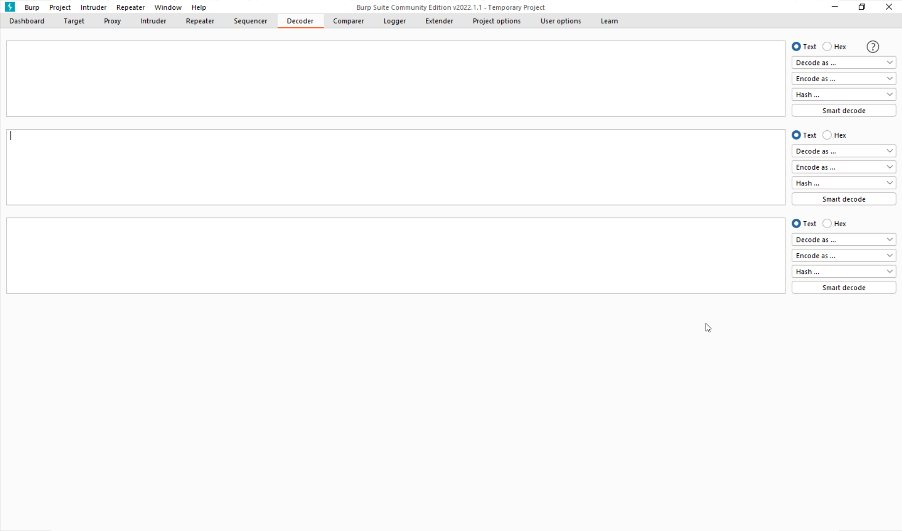
Beberapa tipe encode/decode yang tersedia adalah
- Base64
- URL
- ASCII HEX
### Burp Intruder
Salah satu hal yang penting dalam melakukan Web Penetration testing adalah fuzzing. Fuzzing adalah suatu metode untuk mencari kerentanan keamanan dengan mengirimkan beberapa payload. Pada Burp Suite terdapat fitur fuzzing yang berama Burp Intruder.

cara menggunakannya adalah dengan memilih request mana yang ingin dilakukan fuzzing. Bisa memilihnya dari history ataupun request yang sedang diintercept. Lakukan Klik kanan dan pilih "Send to Intruder". Setelah itu kita dapat menentukan posisis parameter yang ingin dilakukan fuzzing. Kita juga dapat memilih Attack typenya. Beberapa Attack type yang tersedia adalah:
- Sniper
- Battering ram
- Pitchfork
- Cluster Bomb
Untuk lebih jelasnya dapat dibaca melalui https://portswigger.net/burp/documentation/desktop/tools/intruder/attack-types 

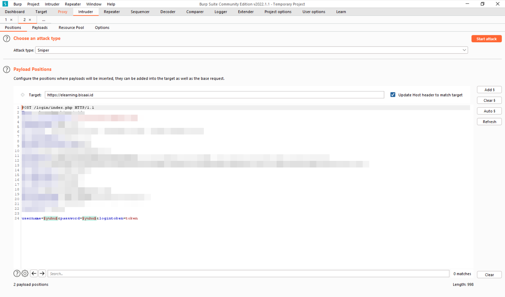

Setelah posisi fuzzing sudah ditentukan saatnya memasukkan payload. Bisa pergi ke tab "Payloads". Disana kalian dapat menambahkan payload sendiri. Untuk melakukan serangan tekan Button "Start Attack"
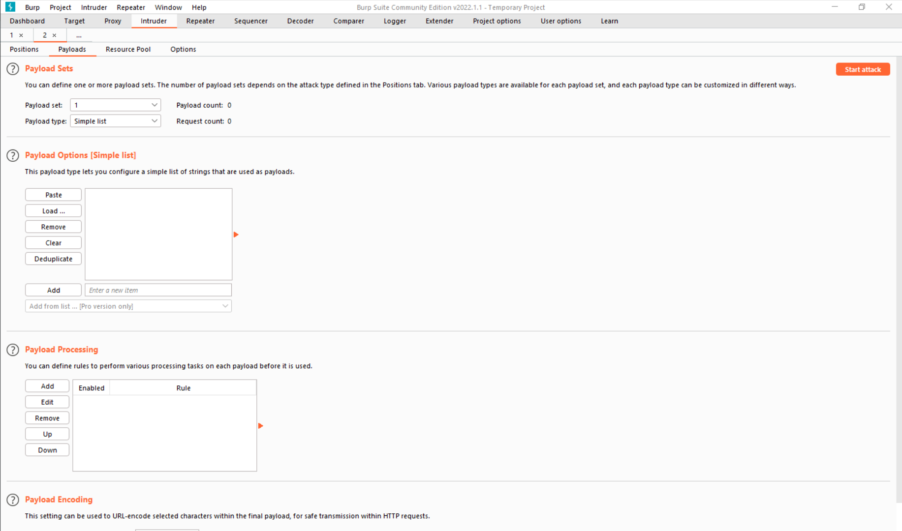
### Rekomendasi tool lainnya
Tool lain yang biasa digunakan adalah OWASP ZAP. Fitur kurang lebih sama dengan burp suite, akan tetapi terdapat fitur yang dimana di Burp Suite itu berbayar teteapi di ZAP ini gratis yaitu scanner. Kalian dapat mengunduh ZAP melalui halaman berikut ini:
https://www.zaproxy.org/download/ . Untuk melakukan konfigurasi hampir sama dengan Burp Suite. Tinggal menginstall tool tersebut. Setelah itu mendapatkan CA Certificate dengan membuka ZAP lalu Tools->Options->Dynamic SSL Certificates->Save. Setelah intu pasang CA Certificate pada Web browser. Untuk web proxy ZAP jugra berjalan pada 127.0.0.1 port 8080 sama seperti Burp Suite.
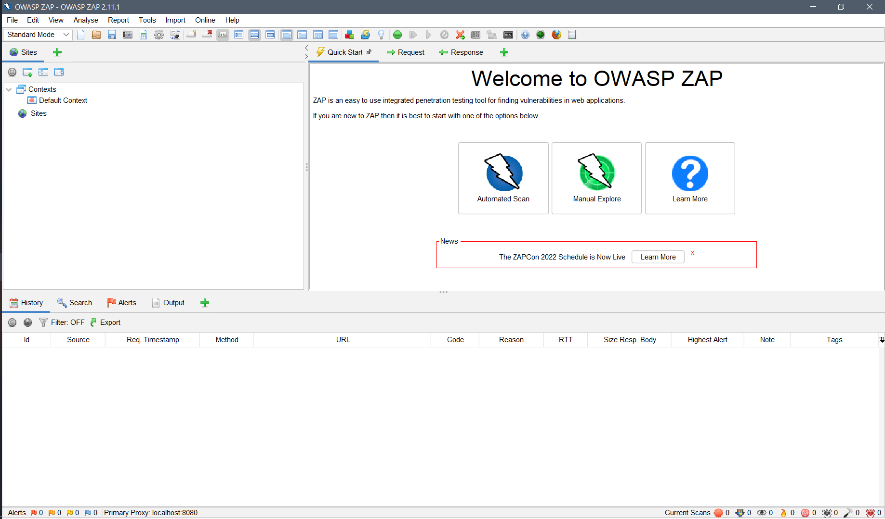